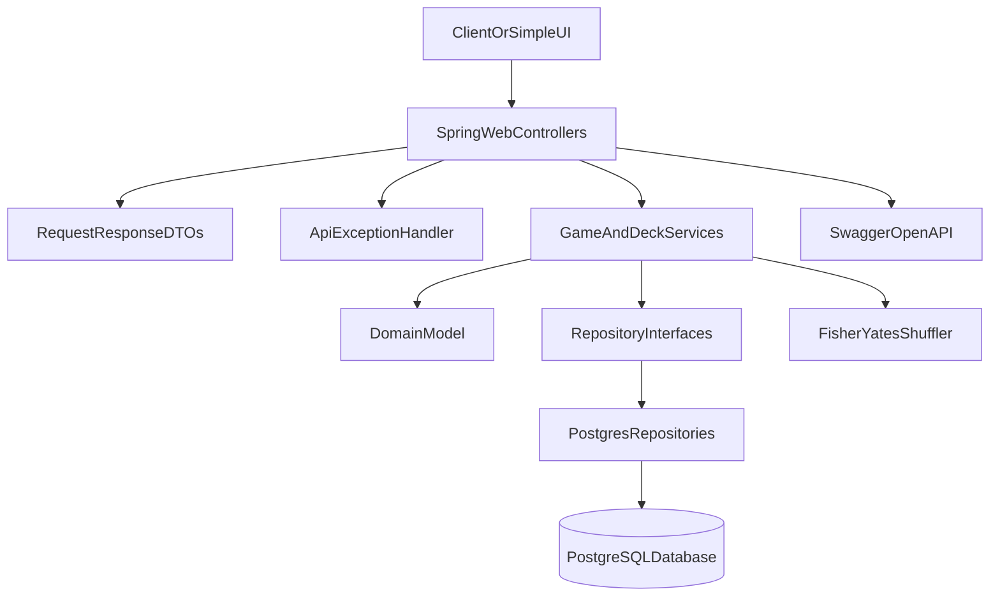

# Deck Service

A Spring Boot REST backend for a basic poker-style deck-of-cards game. The service manages standard 52-card decks, game shoes, players, dealing, scoring, and shuffling.

## Requirements

- Java 21
- Maven 3.9+
- PostgreSQL (local database required at runtime)

## Run

Start a local PostgreSQL database, then configure connection settings in [`src/main/resources/application.properties`](src/main/resources/application.properties):

```properties
spring.datasource.url=jdbc:postgresql://localhost:5432/deckservice
spring.datasource.username=postgres
spring.datasource.password=admin
```

Run the application:

```bash
./mvnw spring-boot:run
```

On startup, Spring Boot executes `schema-postgres.sql` automatically to create tables if they do not exist.

Docker is not required for this stage, but is recommended later for reproducible local and CI environments.

Swagger UI is available at:

- [http://localhost:8080/swagger-ui/index.html](http://localhost:8080/swagger-ui/index.html)

OpenAPI JSON:

- [http://localhost:8080/v3/api-docs](http://localhost:8080/v3/api-docs)

## API Overview

All endpoints are versioned under `/api/v1`.

| Method | Endpoint | Description |
| --- | --- | --- |
| `POST` | `/api/v1/games` | Create a game |
| `DELETE` | `/api/v1/games/{gameId}` | Delete a game |
| `POST` | `/api/v1/decks` | Create a standard 52-card deck |
| `POST` | `/api/v1/games/{gameId}/shoe/decks/{deckId}` | Add a deck to the game shoe |
| `POST` | `/api/v1/games/{gameId}/players` | Add a player |
| `DELETE` | `/api/v1/games/{gameId}/players/{playerId}` | Remove a player |
| `POST` | `/api/v1/games/{gameId}/players/{playerId}/cards:deal` | Deal cards to a player |
| `GET` | `/api/v1/games/{gameId}/players/{playerId}/cards` | Get a player's cards |
| `GET` | `/api/v1/games/{gameId}/players/scores` | Get players sorted by hand value |
| `GET` | `/api/v1/games/{gameId}/shoe/remaining/suits` | Get undealt counts by suit |
| `GET` | `/api/v1/games/{gameId}/shoe/remaining/cards` | Get undealt counts by suit and rank |
| `POST` | `/api/v1/games/{gameId}/shoe:shuffle` | Shuffle undealt shoe cards |

### Example Flow

```bash
curl -X POST http://localhost:8080/api/v1/games
curl -X POST http://localhost:8080/api/v1/decks
curl -X POST http://localhost:8080/api/v1/games/{gameId}/shoe/decks/{deckId}
curl -X POST http://localhost:8080/api/v1/games/{gameId}/players -H "Content-Type: application/json" -d "{\"name\":\"Alice\"}"
curl -X POST http://localhost:8080/api/v1/games/{gameId}/shoe:shuffle
curl -X POST http://localhost:8080/api/v1/games/{gameId}/players/{playerId}/cards:deal -H "Content-Type: application/json" -d "{\"count\":1}"
```

## Architecture



### Layers

- **Domain**: immutable `Card`, `Deck`, and enums; mutable aggregate `Game` with player and shoe state.
- **Repository**: `DeckRepository` and `GameRepository` interfaces with a PostgreSQL JDBC implementation today, leaving room for future database integrations. Game mutations are atomic at the repository boundary.
- **Service**: orchestration, validation, logging, and read workflows for dealing, scoring, remaining counts, and shuffle.
- **API**: versioned REST controllers, DTOs, centralized error handling, and Swagger documentation.

### PostgreSQL Persistence

Runtime persistence uses PostgreSQL with manual SQL via `JdbcClient`. Repository interfaces remain the service boundary so another database implementation can be added later without changing business logic.

PostgreSQL schema (auto-initialized):

- `decks`, `deck_cards`
- `games`, `players`
- `game_shoe_cards`

## Design Decisions And Tradeoffs

### PostgreSQL-first runtime

The application requires PostgreSQL at runtime. Service and controller unit tests use test-only fakes or mocks so default test runs do not need a database.

### No hard player or deck limits

The API does not impose artificial player or deck caps. Dealing naturally stops when the shoe is exhausted. Limits can be added later as configurable policy.

### Multi-deck shoes

Multiple decks can be added to a game shoe. Duplicate suit/rank combinations are tracked explicitly in remaining-card counts.

### Scoring, not winning

The API exposes player score ranking by total face value. There is no winner endpoint because the assignment does not define rounds, turns, or victory rules.

### Custom shuffle

Shuffling uses an explicit Fisher-Yates implementation over undealt cards only. Library shuffle helpers are intentionally avoided.

### Repository-level game atomicity

Game mutations are owned by `GameRepository` intent methods such as `addPlayer`, `dealCards`, and `shuffleUndealtShoe`. Each mutation runs in a single Postgres transaction that locks the `games` row with `SELECT ... FOR UPDATE`, loads the aggregate, applies domain rules, and persists only the affected rows. This removes JVM-local service locking and gives DB-safe concurrency across multiple app instances without changing the schema.

### Targeted PostgreSQL writes

Within each atomic repository mutation, Postgres still uses targeted SQL instead of rewriting whole aggregates. For example, adding a player inserts one `players` row, dealing updates only the affected `game_shoe_cards` rows, and shuffling updates only undealt shoe positions.

### Player removal

Players can be removed only while they hold no cards. Once a player has been dealt cards, removal is rejected to avoid ambiguous shoe ownership.

### Error handling

Domain failures map to consistent JSON error responses:

- `404` for missing games, decks, or players
- `400` for validation failures
- `500` for unexpected errors with server-side logging

## Future Scalable Vision

### PostgreSQL hardening

Future improvements:

- Docker Compose for local PostgreSQL and future CI
- Testcontainers-backed integration tests
- Optional Flyway/Liquibase migrations instead of `schema-postgres.sql` only

### Simple UI follow-up

A future static HTML/JavaScript page can be served from `src/main/resources/static` and call the `/api/v1` endpoints for create game, create deck, add deck, manage players, deal cards, shuffle, and inspect remaining cards.

## Tests

Default unit and controller tests (no local PostgreSQL required):

```bash
./mvnw test
```

Service tests use `FakeGameRepository`, which mirrors the repository atomicity contract in memory so business rules stay fast and DB-free.

Optional PostgreSQL repository integration tests (requires a running local PostgreSQL matching `application.properties`):

```bash
# Linux/macOS or Git Bash
./mvnw test -Dpostgres.tests=true

# Windows PowerShell (quote the -D flag or PowerShell treats ".tests=true" as a Maven phase)
./mvnw test "-Dpostgres.tests=true"
```

These tests cover real persistence round-trips and concurrency behavior such as concurrent dealing under row locks. Tests cover deck creation, dealing behavior, multi-deck shoes, score ordering, remaining counts, shuffle behavior, REST endpoints, and error responses.
