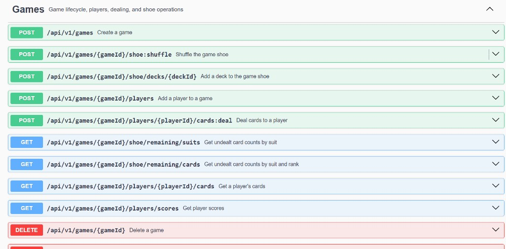
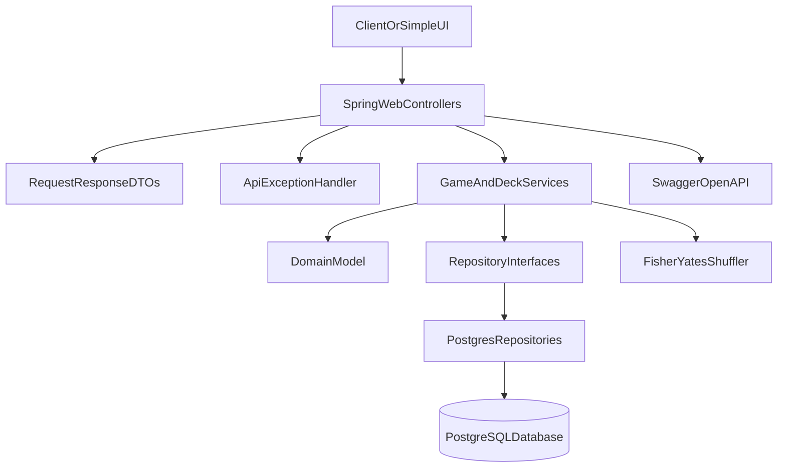
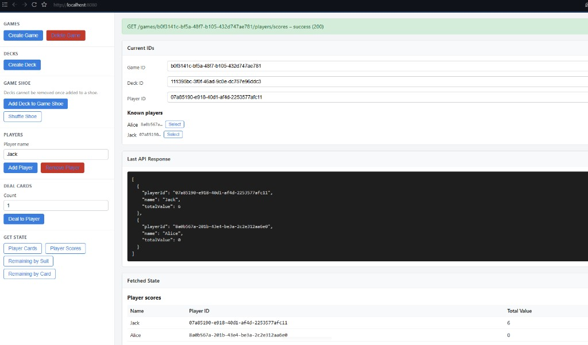

# Deck Service

A Spring Boot REST backend for a basic poker-style deck-of-cards game. The service manages standard 52-card decks, game shoes, players, dealing, scoring, and shuffling.

## Requirements

- Java 21
- Maven 3.9+
- PostgreSQL (required to run the app; not required for the default test suite)

## Database configuration

[`application.properties`](src/main/resources/application.properties) reads connection settings from environment variables, with local-development defaults. Credentials are not committed to the repo.

| Variable | Required | Default |
| --- | --- | --- |
| `SPRING_DATASOURCE_URL` | No | `jdbc:postgresql://localhost:5432/deckservice` |
| `SPRING_DATASOURCE_USERNAME` | No | `postgres` |
| `SPRING_DATASOURCE_PASSWORD` | No | `postgres` |

Create a local PostgreSQL database (for example database name `deckservice`). If your local PostgreSQL uses the defaults above, you can run the app without setting any environment variables.

Override the variables when your setup differs. On Windows PowerShell, `$env:` values apply only to that session; open a new terminal and set them again if needed.

**Linux/macOS/Git Bash:**

```bash
export SPRING_DATASOURCE_URL=jdbc:postgresql://localhost:5432/deckservice
export SPRING_DATASOURCE_USERNAME=postgres
export SPRING_DATASOURCE_PASSWORD=your-password
```

**Windows PowerShell:**

```powershell
$env:SPRING_DATASOURCE_URL = "jdbc:postgresql://localhost:5432/deckservice"
$env:SPRING_DATASOURCE_USERNAME = "postgres"
$env:SPRING_DATASOURCE_PASSWORD = "your-password"
```

Adjust URL, username, and password to match your local PostgreSQL setup.

## Run

With PostgreSQL running (defaults assume local `postgres`/`postgres`; override via environment variables if needed):

```bash
./mvnw spring-boot:run
```

On startup, Spring Boot executes `schema-postgres.sql` automatically to create tables if they do not exist.

Docker is not required for this stage, but is recommended later for reproducible local and CI environments.

Testing UI (simple API tester):

- [http://localhost:8080/](http://localhost:8080/)

Swagger UI is also available at:

- [http://localhost:8080/swagger-ui/index.html](http://localhost:8080/swagger-ui/index.html)



Swagger UI lists all `/api/v1` endpoints with descriptions. Expand any row to try a request, view parameters, and inspect response schemas.

OpenAPI JSON:

- [http://localhost:8080/v3/api-docs](http://localhost:8080/v3/api-docs)

## API Overview

All endpoints are versioned under `/api/v1`.

| Method | Endpoint | Description |
| --- | --- | --- |
| `POST` | `/api/v1/games` | Create a game |
| `DELETE` | `/api/v1/games/{gameId}` | Delete a game |
| `POST` | `/api/v1/decks` | Create a standard 52-card deck |
| `POST` | `/api/v1/games/{gameId}/shoe/decks/{deckId}` | Add a deck to the game shoe |
| `POST` | `/api/v1/games/{gameId}/players` | Add a player |
| `DELETE` | `/api/v1/games/{gameId}/players/{playerId}` | Remove a player |
| `POST` | `/api/v1/games/{gameId}/players/{playerId}/cards:deal` | Deal cards to a player |
| `GET` | `/api/v1/games/{gameId}/players/{playerId}/cards` | Get a player's cards |
| `GET` | `/api/v1/games/{gameId}/players/scores` | Get players sorted by hand value |
| `GET` | `/api/v1/games/{gameId}/shoe/remaining/suits` | Get undealt counts by suit |
| `GET` | `/api/v1/games/{gameId}/shoe/remaining/cards` | Get undealt counts by suit and rank |
| `POST` | `/api/v1/games/{gameId}/shoe:shuffle` | Shuffle undealt shoe cards |

### Example Flow

```bash
curl -X POST http://localhost:8080/api/v1/games
curl -X POST http://localhost:8080/api/v1/decks
curl -X POST http://localhost:8080/api/v1/games/{gameId}/shoe/decks/{deckId}
curl -X POST http://localhost:8080/api/v1/games/{gameId}/players -H "Content-Type: application/json" -d "{\"name\":\"Alice\"}"
curl -X POST http://localhost:8080/api/v1/games/{gameId}/shoe:shuffle
curl -X POST http://localhost:8080/api/v1/games/{gameId}/players/{playerId}/cards:deal -H "Content-Type: application/json" -d "{\"count\":1}"
```

## Architecture



### Layers

- **Domain**: immutable `Card`, `Deck`, and enums; mutable aggregate `Game` with player and shoe state.
- **Repository**: `DeckRepository` and `GameRepository` interfaces with a PostgreSQL JDBC implementation today, leaving room for future database integrations. Game mutations are atomic at the repository boundary.
- **Service**: orchestration, validation, logging, and read workflows for dealing, scoring, remaining counts, and shuffle.
- **API**: versioned REST controllers, DTOs, centralized error handling, and Swagger documentation.

### PostgreSQL Persistence

Runtime persistence uses PostgreSQL with manual SQL via `JdbcClient`. Repository interfaces remain the service boundary so another database implementation can be added later without changing business logic.

PostgreSQL schema (auto-initialized):

- `decks`, `deck_cards`
- `games`, `players`
- `game_shoe_cards`

## Domain Assumptions

These rules define what the service models today. They are enforced in the domain layer and reflected in the PostgreSQL schema.

### Decks

- **A deck can be used in multiple games.** Decks are standalone resources. Adding a deck to a game shoe copies its cards into that game’s `game_shoe_cards` rows; the deck row itself is not consumed or locked to one game.
- **The same deck cannot be added to one game shoe twice.** `Game.appendDeck` rejects a duplicate `deckId` for the same game with a validation error (`Deck is already in the game shoe`).
- **Deleting a game does not delete the decks that were used in it.** `DELETE` on `games` cascades to `players` and `game_shoe_cards`, but `decks` and `deck_cards` are left in the database. Deck rows may therefore outlive any single game that referenced them.

### Players

- **A player is a participant in one specific game, not a global user account.** There is no shared player registry, login, or cross-game identity. Each `POST .../players` call creates a new game-scoped player row with a new UUID.
- **The same player record cannot join multiple games.** A player ID always belongs to exactly one `game_id`. The API does not support reusing an existing player from game A in game B; you add a fresh participant per game instead.
- **The same display name may appear in different games.** `"Alice"` in game 1 and `"Alice"` in game 2 are separate player records with different IDs. Name uniqueness is enforced only within a single game.
- **Deleting a game removes its players.** `players.game_id` references `games(id) ON DELETE CASCADE`, so all players for that game are removed when the game is deleted.

### Game

- **No hard player or deck limits.** The API does not impose artificial player or deck caps. Dealing naturally stops when the shoe is exhausted. Limits can be added later as configurable policy.
- **Scoring, not winning.** The API exposes player score ranking by total face value. There is no winner of a game because the assignment does not define rounds, turns, or victory rules.

## Design Decisions And Tradeoffs

### PostgreSQL-first runtime

The application requires PostgreSQL at runtime. Service and controller unit tests use test-only fakes or mocks so default test runs do not need a database.

### Custom shuffle

Shuffling uses an explicit Fisher-Yates implementation over undealt cards only. Library shuffle helpers are intentionally avoided.

### Repository-level game atomicity

Game mutations are owned by `GameRepository` intent methods such as `addPlayer`, `dealCards`, and `shuffleUndealtShoe`. Each mutation runs in a single Postgres transaction that locks the `games` row with `SELECT ... FOR UPDATE`, loads the aggregate, applies domain rules, and persists only the affected rows. This removes JVM-local service locking and gives DB-safe concurrency across multiple app instances without changing the schema.

### Targeted PostgreSQL writes

Within each atomic repository mutation, Postgres still uses targeted SQL instead of rewriting whole aggregates. For example, adding a player inserts one `players` row, dealing updates only the affected `game_shoe_cards` rows, and shuffling updates only undealt shoe positions.

### Player removal

Players can be removed only while they hold no cards. Once a player has been dealt cards, removal is rejected to avoid ambiguous shoe ownership.

### Error handling

Domain failures map to consistent JSON error responses:

- `404` for missing games, decks, or players
- `400` for validation failures
- `500` for unexpected errors with server-side logging

## Future Scalable Vision

### PostgreSQL hardening

Future improvements:

- Docker Compose for local PostgreSQL and future CI
- Testcontainers-backed integration tests
- Optional Flyway/Liquibase migrations instead of `schema-postgres.sql` only

### Simple testing UI (AI Generated)

A static HTML/JavaScript page is served from [`src/main/resources/static/index.html`](src/main/resources/static/index.html) at [http://localhost:8080/](http://localhost:8080/) when the app is running. No separate frontend build step is required.

**Layout:**

- **Left action menu** — buttons and forms for create/delete game, create deck, add deck to game shoe, add/remove players, shuffle shoe, deal cards, and GET state endpoints.
- **Right panel** — current `gameId`, `deckId`, and `playerId` (editable), known players list, last API response JSON, and formatted fetched state (player cards, scores, remaining shoe counts).

**Example:**



In this example, a game and deck were created, players were added, cards were dealt, and **Player Scores** was fetched. The right panel shows the current IDs, the raw JSON response, and a formatted scores table (Jack with total value 6, Alice with 0).

**Typical workflow:**

1. Open [http://localhost:8080/](http://localhost:8080/) with the app running.
2. Click **Create Game** — the new game ID appears on the right.
3. Click **Create Deck** — the new deck ID appears on the right.
4. Click **Add Deck to Game Shoe**.
5. Enter a player name and click **Add Player**.
6. Optionally click **Shuffle Shoe**.
7. Set a deal count and click **Deal to Player**.
8. Use **Get State** actions (Player Cards, Player Scores, Remaining by Suit, Remaining by Card) to inspect current data on the right.

Success and error messages from the API are shown at the top of the right panel. Decks cannot be removed from a game shoe once added (matching the API contract).

## Tests

### Default test suite (no PostgreSQL or env vars)

```bash
./mvnw test
```

This runs unit and controller tests only. Service tests use `FakeGameRepository`, which mirrors the repository atomicity contract in memory so business rules stay fast and DB-free. You do **not** need to set `SPRING_DATASOURCE_*` for this command.

### Optional PostgreSQL integration tests

These tests are disabled by default. To run them, you need:

1. A running local PostgreSQL instance
2. Matching datasource settings — use the defaults above, or set `SPRING_DATASOURCE_URL`, `SPRING_DATASOURCE_USERNAME`, and `SPRING_DATASOURCE_PASSWORD` in the same terminal session before Maven if your setup differs

**Linux/macOS or Git Bash:**

```bash
export SPRING_DATASOURCE_URL=jdbc:postgresql://localhost:5432/deckservice
export SPRING_DATASOURCE_USERNAME=postgres
export SPRING_DATASOURCE_PASSWORD=your-password
./mvnw test -Dpostgres.tests=true
```

**Windows PowerShell:**

```powershell
$env:SPRING_DATASOURCE_URL = "jdbc:postgresql://localhost:5432/deckservice"
$env:SPRING_DATASOURCE_USERNAME = "postgres"
$env:SPRING_DATASOURCE_PASSWORD = "your-password"
./mvnw test "-Dpostgres.tests=true"
```

These tests use `@SpringBootTest` and load the main application context, so they use the same datasource configuration as the running app. They cover real persistence round-trips and concurrency behavior such as concurrent dealing under row locks.
