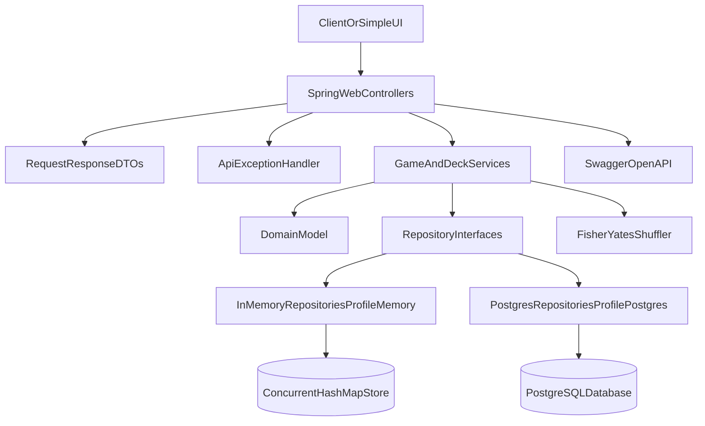

# Deck Service

A Spring Boot REST backend for a basic poker-style deck-of-cards game. The service manages standard 52-card decks, game shoes, players, dealing, scoring, and shuffling.

## Requirements

- Java 21
- Maven 3.9+

## Run

```bash
./mvnw spring-boot:run
```

The application starts with the in-memory profile by default:

```properties
spring.profiles.active=memory
```

### PostgreSQL mode

To run against a local PostgreSQL database:

```bash
# Windows PowerShell
$env:SPRING_PROFILES_ACTIVE="postgres"; ./mvnw spring-boot:run

# Linux/macOS
SPRING_PROFILES_ACTIVE=postgres ./mvnw spring-boot:run
```

Local PostgreSQL assumptions for the `postgres` profile:

- Database: `deckservice`
- Host/port: `localhost:5432`
- Username/password: `admin` / `admin`

On startup, Spring Boot executes `schema-postgres.sql` automatically to create tables if they do not exist.

Docker is not required for this stage, but is recommended later for reproducible local and CI environments.

Swagger UI is available at:

- [http://localhost:8080/swagger-ui/index.html](http://localhost:8080/swagger-ui/index.html)

OpenAPI JSON:

- [http://localhost:8080/v3/api-docs](http://localhost:8080/v3/api-docs)

## API Overview

All endpoints are versioned under `/api/v1`.

| Method | Endpoint | Description |
| --- | --- | --- |
| `POST` | `/api/v1/games` | Create a game |
| `DELETE` | `/api/v1/games/{gameId}` | Delete a game |
| `POST` | `/api/v1/decks` | Create a standard 52-card deck |
| `POST` | `/api/v1/games/{gameId}/shoe/decks/{deckId}` | Add a deck to the game shoe |
| `POST` | `/api/v1/games/{gameId}/players` | Add a player |
| `DELETE` | `/api/v1/games/{gameId}/players/{playerId}` | Remove a player |
| `POST` | `/api/v1/games/{gameId}/players/{playerId}/cards:deal` | Deal cards to a player |
| `GET` | `/api/v1/games/{gameId}/players/{playerId}/cards` | Get a player's cards |
| `GET` | `/api/v1/games/{gameId}/players/scores` | Get players sorted by hand value |
| `GET` | `/api/v1/games/{gameId}/shoe/remaining/suits` | Get undealt counts by suit |
| `GET` | `/api/v1/games/{gameId}/shoe/remaining/cards` | Get undealt counts by suit and rank |
| `POST` | `/api/v1/games/{gameId}/shoe:shuffle` | Shuffle undealt shoe cards |

### Example Flow

```bash
curl -X POST http://localhost:8080/api/v1/games
curl -X POST http://localhost:8080/api/v1/decks
curl -X POST http://localhost:8080/api/v1/games/{gameId}/shoe/decks/{deckId}
curl -X POST http://localhost:8080/api/v1/games/{gameId}/players -H "Content-Type: application/json" -d "{\"name\":\"Alice\"}"
curl -X POST http://localhost:8080/api/v1/games/{gameId}/shoe:shuffle
curl -X POST http://localhost:8080/api/v1/games/{gameId}/players/{playerId}/cards:deal -H "Content-Type: application/json" -d "{\"count\":1}"
```

## Architecture



### Layers

- **Domain**: immutable `Card`, `Deck`, and enums; mutable aggregate `Game` with player and shoe state.
- **Repository**: `DeckRepository` and `GameRepository` interfaces with profile-specific implementations.
- **Service**: application workflows for dealing, scoring, remaining counts, and shuffle.
- **API**: versioned REST controllers, DTOs, centralized error handling, and Swagger documentation.

### Persistence Profiles

- `memory` (default): in-memory repositories backed by `ConcurrentHashMap`.
- `postgres`: JDBC repositories backed by PostgreSQL with manual SQL via `JdbcClient`.

Services depend only on repository interfaces, so storage can be swapped without changing business logic.

PostgreSQL schema (auto-initialized):

- `decks`, `deck_cards`
- `games`, `players`
- `game_shoe_cards`

## Design Decisions And Tradeoffs

### In-memory first

The first implementation keeps state in process memory for speed of delivery and testability. This is appropriate for the assignment scope and local development, but state is lost on restart.

### No hard player or deck limits

The API does not impose artificial player or deck caps. Dealing naturally stops when the shoe is exhausted. Limits can be added later as configurable policy.

### Multi-deck shoes

Multiple decks can be added to a game shoe. Duplicate suit/rank combinations are tracked explicitly in remaining-card counts.

### Scoring, not winning

The API exposes player score ranking by total face value. There is no winner endpoint because the assignment does not define rounds, turns, or victory rules.

### Custom shuffle

Shuffling uses an explicit Fisher-Yates implementation over undealt cards only. Library shuffle helpers are intentionally avoided.

### Error handling

Domain failures map to consistent JSON error responses:

- `404` for missing games, decks, or players
- `400` for validation failures
- `500` for unexpected errors with server-side logging

## Future Scalable Vision

### PostgreSQL hardening

The first PostgreSQL implementation uses aggregate replacement on save for simplicity. Future improvements:

- Docker Compose for local PostgreSQL and future CI
- Testcontainers-backed integration tests
- Targeted SQL updates instead of full aggregate replacement for large games
- Optional Flyway/Liquibase migrations instead of `schema-postgres.sql` only

### Simple UI follow-up

A future static HTML/JavaScript page can be served from `src/main/resources/static` and call the `/api/v1` endpoints for create game, create deck, add deck, manage players, deal cards, shuffle, and inspect remaining cards.

## Tests

```bash
./mvnw test
```

Optional PostgreSQL repository integration tests (requires a running local PostgreSQL matching the `postgres` profile):

```bash
./mvnw test -Dpostgres.tests=true
```

Tests cover deck creation, dealing behavior, multi-deck shoes, score ordering, remaining counts, shuffle behavior, REST endpoints, and error responses.
